<div align="center">


<h1>Azure OpenAI Secure Reference</h1>

<p><strong>Secure, Scalable, Zero-Trust Generative AI Platform & RAG Foundation for Microsoft Azure</strong></p>

[](https://devopstrio.co.uk/)
[](https://devopstrio.co.uk/)
[](https://devopstrio.co.uk/)
[](/apps/agent-engine)

</div>

---

## 🏛️ Executive Summary

The **Azure OpenAI Secure Reference** platform is a flagship enterprise solution designed to architect and deliver production-ready generative AI environments on Microsoft Azure. In the rapidly evolving AI landscape, organizations face significant challenges around **data sovereignty**, **network isolation**, **responsible AI governance**, and **cost predictability**. This platform establishes a hardened, enterprise-grade AI foundation that codifies security best practices with advanced RAG (Retrieval-Augmented Generation) and agentic workflows.

By integrating sophisticated **RAG, Agent, and Governance Engines**, the platform automates the deployment of secure multi-model environments, enforces data protection through **Private Link and Zero-Trust networking**, and provides a unified "PromptOps" framework for managing AI logic at scale. It provides a boardroom-ready Command Center that gives executives real-time visibility into AI adoption trends, token-level cost attribution, and compliance with responsible AI guardrails, ensuring that AI innovation scales securely across the entire enterprise.

### Strategic Business Outcomes
- **Accelerated AI Innovation**: Launch secure, pre-configured AI blueprints (Chat, RAG, Agents) in minutes instead of months, enabling business units to experiment safely.
- **Hardened Data Protection**: Ensure enterprise data never leaves the secure Azure perimeter through Private Endpoints, VNET isolation, and automated PII redaction.
- **Responsible AI Governance**: Implement automated guardrails to prevent harmful outputs, ensure citation transparency, and maintain an immutable audit trail of all AI interactions.
- **Granular Cost Control**: Gain full transparency into AI consumption with token-based chargeback models and automated budget alerts per business unit or project.

---

## 🏗️ Technical Architecture Details

### 1. High-Level AI Platform Architecture
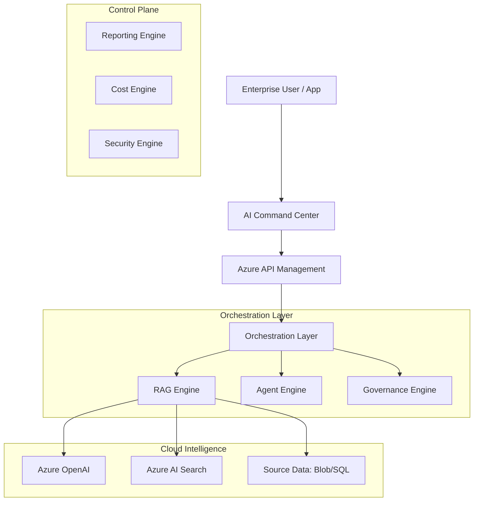

### 2. RAG Ingestion & Retrieval Workflow
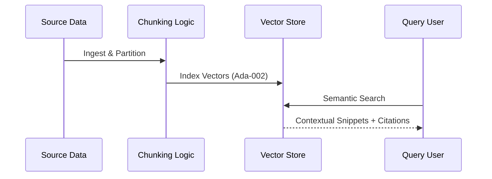

### 3. Agent Execution Lifecycle
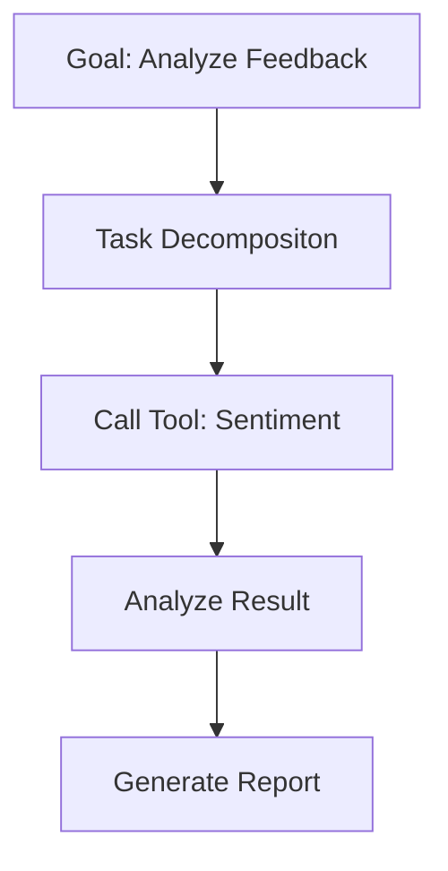

### 4. Prompt Approval & Governance Flow
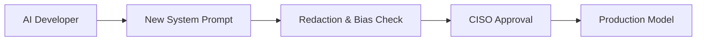

### 5. Cost Governance Workflow
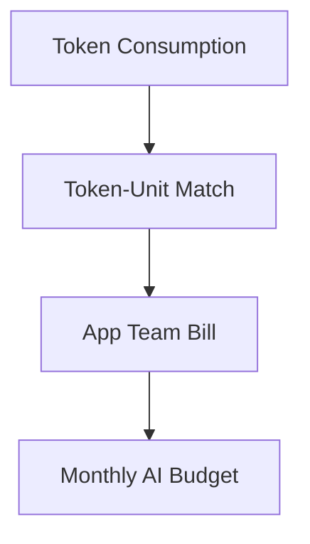

### 6. Security Trust Boundary
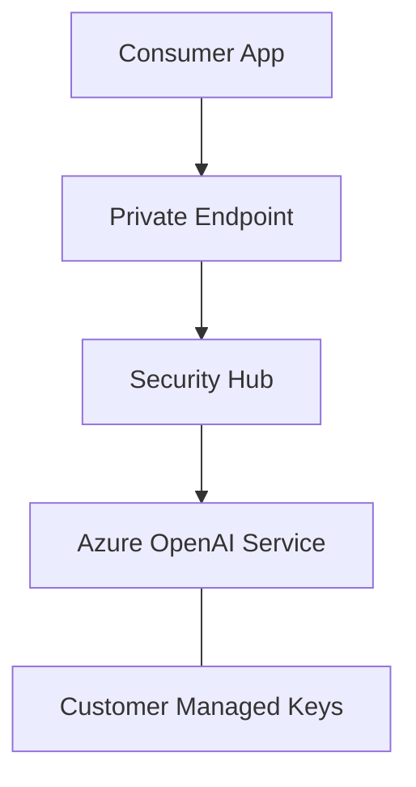

### 7. Azure Global AI Topology
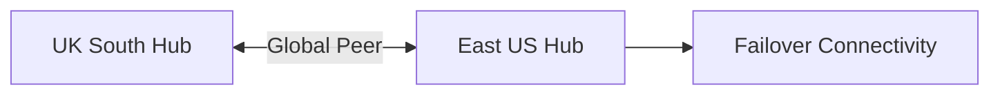

### 8. API Request Lifecycle
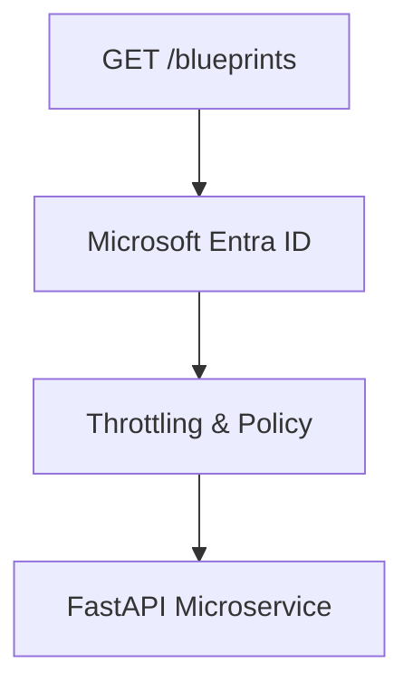

### 9. Multi-Tenant Tenancy Model
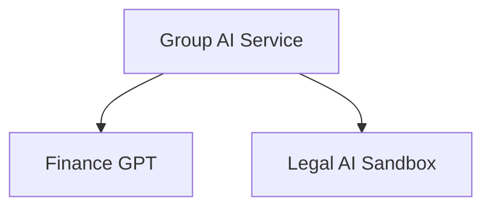

### 10. Monitoring & Telemetry Flow
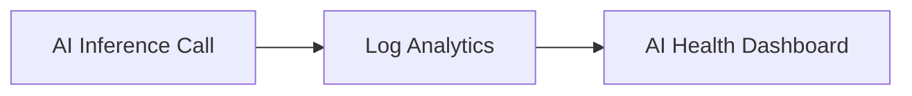

### 11. Disaster Recovery Topology
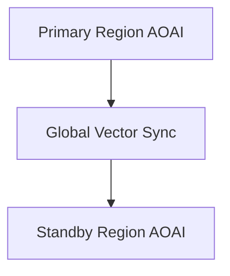

### 12. Private Endpoint Connection Flow
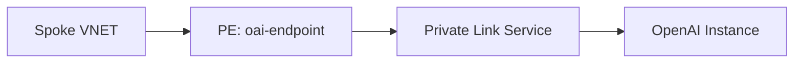

### 13. Identity Federation Model
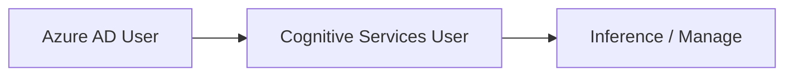

### 14. Model Routing Workflow
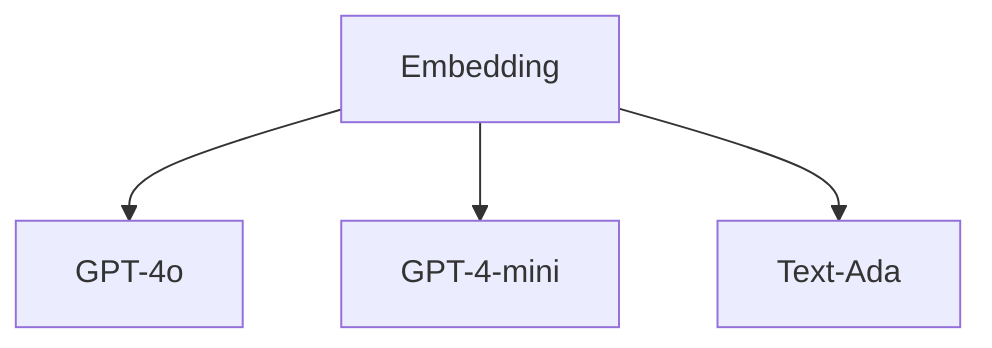

### 15. CI/CD AI Pipeline
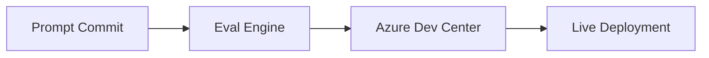

### 16. Executive Governance Workflow
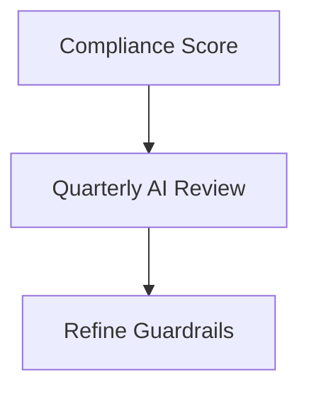

### 17. Data Source Sync Flow
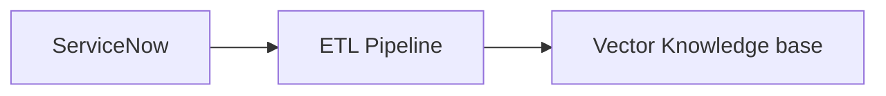

### 18. Global Region Topology
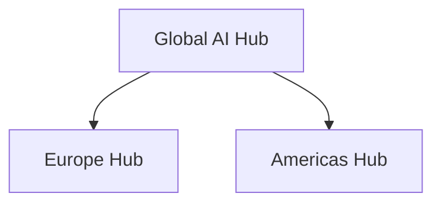

### 19. Chargeback Workflow
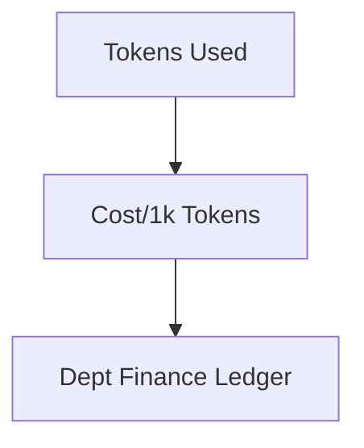

### 20. Responsible AI Control Loop
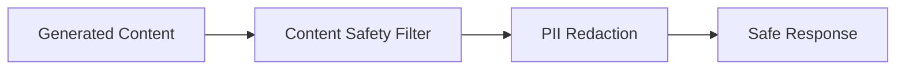

---

## 🚀 Deployment Guide

### Terraform Platform Rollout
```bash
cd terraform/environments/prd
terraform init
terraform apply -auto-approve
```

---
<sub>&copy; 2026 Devopstrio &mdash; Engineering the Scalable Foundation for the Next-Generation Secure AI Enterprise.</sub>
